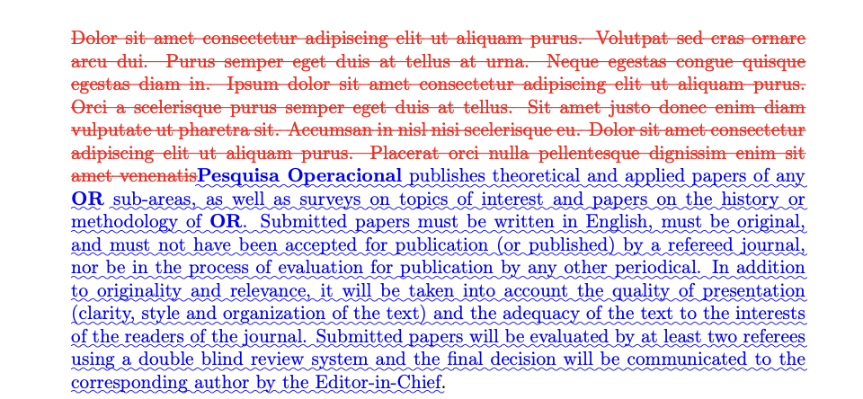

# Git Latex Diff on Hugging Face Spaces

You can see the [Live Demo Here!](https://huggingface.co/spaces/taesiri/LatexDiff)

Applies [git-latexdiff](https://gitlab.com/git-latexdiff/git-latexdiff) on your tex projects!

## How to use with Overleaf

Just download a `zip` file for two different versions of your latex project. Then provide the zip files to demo, and it will **hopefully** generate a latex diff.

## Sample output

